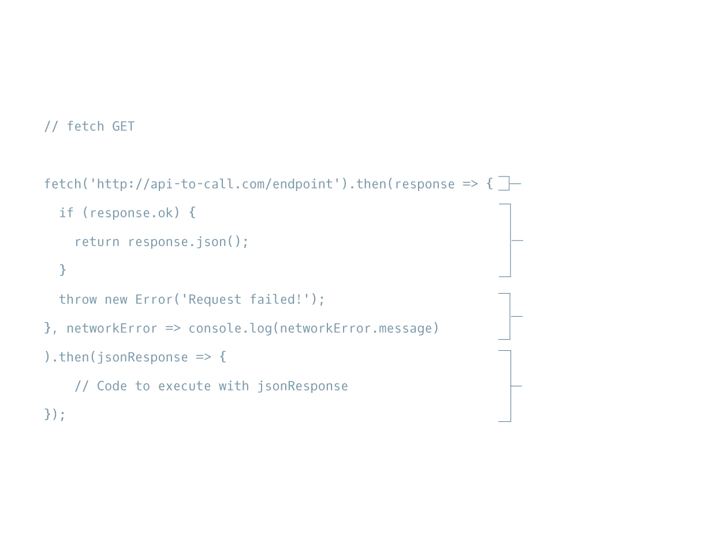

# CodeCademy Introduction To JavaScript

## REQUESTS II

### Index
1. Introduction to Requests with ES6
2. fetch() GET Requests I
3. fetch() GET Requests II
4. fetch() GET Requests III
5. fetch() GET Requests IV
6. fetch() POST Requests I
7. fetch() POST Requests II
8. fetch() POST Requests III
9. fetch() POST Requests IV
10. fetch() POST Requests V
11. async GET Requests I
12. async GET Requests II
13. async GET Requests III
14. async POST Requests I
15. async POST Requests II
16. async POST Requests III
17. Review Requests II

## Introduction to Requests with ES6

#### Files

- **01-request2.html**
- **01-request2.js**
- **public/01-request2.css**


In the previous lesson, we spent a lot of time dealing with asynchronous data (remember AJAX/ Asynchronous JavaScript And XML?). Many of our web page interactions rely on asynchronous events, so managing these events is essential to good web development.

To make asynchronous event handling easier, *promises* were introduced in JavaScript in ES6:

- [Mozilla Development Network: Promises](https://developer.mozilla.org/en-US/docs/Web/JavaScript/Reference/Global_Objects/Promise)

A promise is an object that handles asynchronous data. A promise has three states:

*pending* : when a promise is created or waiting for data.
*fulfilled* : the asynchronous operation was handled successfully.
*rejected* : the asynchronous operation was unsuccessful.

The great thing about promises is that once a promise is fulfilled or rejected, you can chain an additional method to the original promise.

In this lesson, we will explain how to use `fetch()`, which uses promises to handle requests. Then, we will simplify requests using `async` and `await`.

We’ll use the [Datamuse API](https://www.datamuse.com/api/) for GET requests and Rebrandly URL Shortener API for POST requests. If you don't already have a Rebrandly API, check the requests1-readme.md to create one.

***

#### REQUESTS II

## fetch() GET Requests I

#### Files

- **No files, information only.**

The first type of requests we’re going to tackle are GET requests using `fetch()`

- [MDN: Fetch API.](https://developer.mozilla.org/en-US/docs/Web/API/Fetch_API)

The `fetch()` function:

- Creates a request object that contains relevant information that an API needs.
- Sends that request object to the API endpoint provided.
- Returns a promise that ultimately resolves to a response object, which contains the status of the promise with information the API sent back.

In the next exercise we’ll go over the boilerplate code for using `fetch()` and walk through what each step does!



***

#### REQUESTS II

## fetch() GET Requests II

#### Files

- **02-request2.js**

We are going to reconstruct the boilerplate code necessary to create a GET request using the `fetch()` function step-by-step.

Feel free to refer to the `fetch()` GET diagram (above) at any point while completing this exercise.

***

#### REQUESTS II

## fetch() GET Requests III

#### Files

- **03-request2.html**
- **03-request2.js**
- **public/03-helperFunctions.js**
- **public/03-request2.css**

In the previous exercise, you wrote the boilerplate code for a GET request using `fetch()` and `.then()`. In this exercise, you’re going to use that code and manipulate it to access the Datamuse API and render information in the browser.

[Datamuse API.](https://www.datamuse.com/api/)

If the request is successful, you’ll get back an array of words that sound like the word you typed into the input field.

You may get some errors as you complete each step. This is because sometimes we’ve split a single step into one or more steps to make it easier to follow. By the end, you should be receiving no errors.

**Instructions**

1. At the top of the file, create a `const` called `url`. Assign url to the following URL as a string:

```
'https://api.datamuse.com/words'
```

2.Below `url`, create another `const` and call it `queryParams`. Assign it a value of `'?sl='`

`queryParams` will be the start of your query string and will narrow your search to words that sounds like your word.

3. Inside the `getSuggestions()` function, create a `const` called `wordQuery` and assign it `inputField.value`.

You’ll need `wordQuery` to store the value of what is being typed into the input field.

You will be working inside `getSuggestions()` for the remainder of this exercise.

4. Now it’s time to add a query string to the URL with all the necessary parameters.

Create another `const` called `endpoint`, assign it value of a *string* that is `url`, `queryParams`, and `wordQuery` *concatenated* in that order.

5. Call the `fetch()` function and pass in `endpoint` as an argument.

6. Chain a `.then()` method to the `fetch()` function. Pass it a success arrow callback function as an argument. The callback function should take `response` as its single parameter.

7. Inside the success callback function, create a conditional statement that checks if the `ok` property of the `response` object evaluates to a truthy value. If so, call the function `renderJsonResponse()` and pass in `response` as an argument. Then, run your code.

Then type in a word to and click the submit button to view the JSON that came back. The status of the promise return from `fetch()` will be resolved.

The code for `renderJsonResponse()` can be viewed at **public/03-helperFunctions.js**.

8. Delete `renderJsonResponse(response)` and replace it with `return response.json()`.

By returning `response.json()`, the next function that is `.then()` chained to it will receive a Promise with JSON data.

9. Below the condition’s code block, add this code to raise an exception if the request failed: `throw new Error('Request failed!');`

10. Separate the success callback function and the error callback function with a *comma*. The error callback function will also be an arrow function that takes one parameter, `networkError`. In the code block of the arrow function, log `networkError.message` to the console.

***

#### REQUESTS II

## fetch() GET Requests IV

#### Files

- **03-request2.html**
- **03-request2.js**
- **public/03-helperFunctions.js**
- **public/03-request2.css**

In the previous exercise, you created the query URL, called the `fetch()` function and passed it the query URL and a settings object. Then, you chained a `.then()` method and passed it two functions as arguments — one to handle the promise if it resolves, and one to handle network errors if the promise is rejected.

In this exercise, you’ll now take the information that was returned with the promise and manipulate the webpage!

**Instructions**

1. At the end of the `.then()` method, chain another `.then()` method.

Pass `.then()` an anonymous arrow callback function that takes `jsonResponse` as its single parameter.

2. Inside the callback function, call the function `renderRawResponse()` and pass in `jsonResponse` as an argument. Run the code.

In the input field, you can type in a word and click the submit button.

If all went well, you should see an array of words that the Datamuse API responded with!

You can view the purpose of `renderRawResponse` at public/03-helperFunctions.js.

3. Time to clean up that response a bit. Delete `renderRawResponse(jsonResponse)` and replace it with `renderResponse(jsonResponse)`.

Run your code.

***

#### REQUESTS II

## fetch() POST Requests I

#### Files

- **No files, information only.**

In the previous exercise, you successfully wrote a GET request using the fetch API and handled Promises to get word suggestions from Datamuse.

Now, you’re going to learn how to use `fetch()` to construct POST requests!

Take a look at the diagram below. It has the boilerplate code for a POST request using `fetch()`.

Notice that the initial call takes two arguments: an endpoint and an object that contains information needed for the POST request. The rest of the request is identical to the GET request.


***

#### REQUESTS II

## fetch() POST Requests II

#### Files

- **04-request2.js**

We are going to reconstruct the code from the previous exercise step-by-step until we have written a complete POST request using `fetch()` and `.then()`.

**Instructions**

1. Call the `fetch()` function, pass it the URL below as a string as its first argument, and pass it an empty object (`{}`) as its second argument.

```
https://api-to-call.com/endpoint
```

We’re calling `fetch()` and providing an endpoint. In the next step we’ll fill in the empty object with the necessary information.

2. The settings object you passed to the `fetch()` function will contain two properties: `method`, with a value of `'POST'`, and `body`, with a value of `JSON.stringify({id: '200'})`.

This second argument determines that this request is a POST request and what information will be sent to the API.

3. Chain a `.then()` method to the `fetch()` function and pass it the success callback function as its first parameter. Pass in `response` as an argument for the callback function. Leave the code block of the callback function empty for now.

The code inside `.then()` will execute when the promise returned from `fetch()` is resolved.

4. Inside the callback function’s code block, check the `ok` property of the `response` object inside of a conditional statement. In the code block of the conditional statement, *return* `response.json()`.

When `return`ed, this information will be passed on to the next `.then()` callback function.

5. Below the curly braces of the conditional statement, create a new error with this code:

```
throw new Error('Request failed!');
```

*This error will be raised if we get back some status error*.

6. Create the failure callback function. This function takes a single parameter, `networkError`. Separate the first callback function from the second with a *comma*. This function is still inside of the `.then()` method.

In the code block of the function you just made, log `networkError.message` to the console.

7. Chain another `.then()` method to the end of the first `.then()` method.

In the new `.then()` method, create an arrow callback function that takes `jsonResponse` as its parameter.

Then in the code block `return jsonResponse`.

The purpose of this step is to view the JSON that was returned from the previous `.then()`.

***

#### REQUESTS II

## fetch() POST Requests III

#### Files

- **05-request2.js**
- **05-request2.html**
- **public/05-request2.css**
- **public/05-helperFunctions.js**

In the previous exercise, you created the boilerplate code for making a POST request using `fetch()` and `.then()`. In this exercise, you’re going to update that boilerplate code to allow you to shorten a URL using the Rebrandly URL Shortener API.

- [Rebrandly API](https://developers.rebrandly.com/)

If you haven’t already created a Rebrandly API key, read through the Rebrandly sign up guide:

- [Codecademy Articles: Rebrandly URL Shortener API](https://www.codecademy.com/articles/rebrandly-signup)

**Instructions**

1. Assign `apiKey` to your Rebrandly API key as a *string*.

If you do not assign the correct key, you will not see the proper results in the steps afterwards.

2. Inside the code block of `shortenUrl()`, create a `const` named `urlToShorten` and assign it `inputField.value`. `urlToShorten` will keep the value of what is being typed into the input field.

Please note, you will be working inside `shortenUrl()` for the remainder of this exercise.

3. Underneath `urlToShorten`, create another `const` named `data`, and assign it to the result of calling the method `JSON.stringify()` with `{destination: urlToShorten}` as an argument.

The reason for creating `data` is to prepare the information needed to send in the body.

4. Below `data`, call the `fetch()` function. Pass it `url` as its first argument and an empty object as its second argument.

5. Now it’s time to add some properties to the empty object that you just created. Create a property with the key `method` and the value `'POST'`.

6. In the same object, create another property. The key for this property is `headers` and the value will be another object.

Assign `headers` the value of another object listed below:

```
{
  'Content-type': 'application/json',
  'apikey': apiKey
}
```

7. In that same object that has the properties `method` and `headers`, add another property. The key is named `body` and the value will be `data`.

Setting up this information now will make chaining `.then()` in the next exercise much easier!

***

#### REQUESTS II

## fetch() POST Requests IV

#### Files

- **05-request2.js**
- **05-request2.html**
- **public/05-request2.css**
- **public/05-helperFunctions.js**

In the previous exercise you’ve positioned yourself to make the POST request by providing the endpoint and the object containing all the necessary information. In this exercise you’ll handle the response.

The request returns a **Promise** which will either be *resolved* or *rejected*. If the promise resolves, you can use that information and the `ok` status. Let’s implement that knowledge into your code!

**Instructions**

1. Chain a `.then()` method to the end of the` fetch()` function you wrote in the previous exercise. As its first argument, pass it an arrow function as a callback that takes `response` as its single parameter.

2. Inside the block of the function you made in Step 1, use a *conditional statement* to check the value of the `ok` property of response. If it evaluates to a truthy value, call `renderJsonResponse()` and pass in response.

Run the code.

Now, if you post a URL, you should see the object that was sent back!

`renderJsonResponse()` is a helper function found in **public/05-helperFunctions.js**.

3. Great, now that you see the raw object, you will need to pass the JSON to the next `.then()`. Delete `renderJsonResponse(response)` and replace it with `return response.json()`.

4. Below the curly braces of the conditional statement, `throw` a `new` `Error` in case `response.ok` is falsy.

The message the error should raise is `‘Request failed!’`.

5. Outside of the code block from the first callback function you wrote, add another arrow callback function that takes `networkError` as a single parameter.

`console.log()` the `networkError.message` inside of the callback function you just wrote.

By adding this second callback, you’re safeguarding yourself in the rare event that the network returns an error!

***

#### REQUESTS II

## fetch() POST Requests V

#### Files

- **05-request2.js**
- **05-request2.html**
- **public/05-request2.css**
- **public/05-helperFunctions.js**

You’re almost done with the POST request you started a few lessons back!

In fact, this time you’ll add another `.then()` to the chain to finally make the information available to your webpage!

**Instructions**

1. Chain a `.then()` method to the end of the original `.then()` method.

2. Pass in an anonymous arrow function as an argument for `.then()`. This callback function will take `jsonResponse` as its single parameter.

Inside the callback function, call `renderRawResponse()` and pass in `jsonResponse`.

Run the code.

Put in any URL in the text field, and then click the shorten button on the webpage. Make sure you include the entire link, including ‘http://‘ or ‘https://‘.

You’ll see the JSON of the response sent back from the API.

The `renderRawResponse()` helper function can be viewed at **public/05-helperFunctions.js.**

3. Delete `renderRawResponse(jsonResponse)`. In its place, call `renderResponse()` and passing in `jsonResponse`.

Run the code.

Put a URL into the text field again and then click the Shorten button on the web page. Notice the difference?

The `renderResponse()` helper function can be viewed at **public/05-helperFunctions.js.**

***

#### REQUESTS II

## async GET Requests I

#### Files

- **No files, information only.**

Let’s take a minute to appreciate what you’ve accomplished so far:

- used `fetch()` to make GET and POST requests.
- check the status of the responses coming back
- catch errors that might possibly arise
- taking successful responses and rendering it on the webpage

That is fantastic! It’s the basis of how the internet works!

In the following exercises, we’re going to take what you’ve learned about chaining Promises and make it simpler using functionality introduced in ES8: async and await. You read that right, you did the hard part already, now it’s time to make it easier.

The structure for this request will also be slightly different. Notice the new keywords async and await, as well as the try and catch statements.

We’ll be going over how to write the boilerplate code for async GET requests in the next lesson.