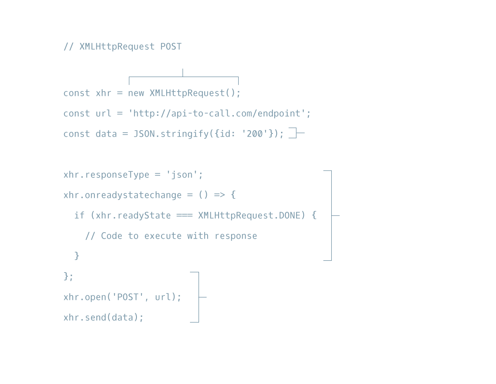

# CodeCademy Introduction To JavaScript

## REQUESTS I

### Index
1. Introduction to Requests I
2. HTTP Requests
3. XHR GET Requests I
4. XHR GET Requests II
5. XHR GET Requests III
6. XHR GET Requests IV
7. XHR POST Requests I
8. XHR POST Requests II
9. XHR POST Requests III
10. Review Requests I

## Introduction to Requests I

Have you ever wondered what happens after you click a “Submit” button on a web page? For instance, if you are submitting information, where does the information go? How is the information processed? The answer to the previous questions revolves around *HTTP* requests.

There are many types of HTTP requests. The four most commonly used types of HTTP requests are GET, POST, PUT, and DELETE. In this lesson, we’ll cover GET and POST requests. If you want to learn more about the different HTTP requests, we recommend the following documentation:

- [Mozilla Developer Network: HTTP methods](https://developer.mozilla.org/en-US/docs/Web/HTTP/Methods)

With a GET request, we’re retrieving, or *getting*, information from some source (usually a website). For a POST request, we’re *posting* information to a source that will process the information and send it back.

In this lesson, we will explain how to make GET and POST requests by using JavaScript’s **XHR** object. We’ll also incorporate query strings into our requests.

We’ll use the Datamuse API for GET requests and the Rebrandly URL Shortener API for POST requests. To complete the exercise on POST, make sure you create a Rebrandly API Key by following the instructions in the article below:

- [Codecademy Articles: Rebrandly URL Shortener API](https://www.codecademy.com/articles/rebrandly-signup)

#### Files

- **intro.html**
- **/public/intro.js**

**File instructions:**
Click the button on the web page to see what the code in main.js does.

You’ll see *JSON* being displayed on the page. JSON, JavaScript Object Notation, will be the format in which our data is sent to us. That button you click produces a GET request. That’s right, you’ve just made a GET request!

***

#### REQUESTS I

## HTTP Requests

#### Files

- **01-request.js**

One of JavaScript’s greatest assets is its non-blocking properties, or that it is an *asynchronous* language.

Websites, like newspaper websites, take advantage of these non-blocking properties to provide a better user experience. Generally, a site’s code is written so that users don’t have to wait for a giant image to load before being allowed to read the actual article—rather, that text is rendered first and then the image can load in the background.

JavaScript uses an *event loop* to handle asynchronous function calls. When a program is run, function calls are made and added to a stack. The functions that make requests that need to wait for servers to respond then get sent to a separate queue. Once the stack has cleared, then the functions in the queue are executed.

Web developers use the event loop to create a smoother browsing experience by deciding when to call functions and how to handle asynchronous events. We’ll be exploring one system of technologies called Asynchronous JavaScript and XML, or AJAX.

To read more about the event loop, read the MDN documentation:

- [MDN Documentation: Event Loop](https://developer.mozilla.org/en-US/docs/Web/JavaScript/EventLoop)

***

#### REQUESTS I

## XHR GET Requests I

#### Files

- **No files, information only.**

Asynchronous JavaScript and XML (AJAX), enables requests to be made after the initial page load. Initially, AJAX was used only for XML formatted data, now it can be used to make requests that have many different formats.

- [MDN Documentation: Extensible Markup Language (XML)](https://developer.mozilla.org/en-US/docs/XML_introduction).

Similarly, the XMLHttpRequest (XHR) API, named for XML, can be used to make many kinds of requests and supports other forms of data.

Remember, we use GET to retrieve data from a source. Take a look at the boilerplate code in the diagram to see how to make an XHR GET request.


We’ll construct this template from scratch in a different exercise and walk through what each step does.

***

#### REQUESTS I

## XHR GET Requests II

#### Files

- **03-request.js**

We are going to reconstruct XHR GET request boilerplate code step-by-step until we have written a complete GET request.

Feel free to refer to the XHR GET diagram at any point while completing this exercise:

- [XHR GET diagram](https://s3.amazonaws.com/codecademy-content/courses/intermediate-javascript-requests/diagrams/XHR+GET+diagram.svg)

1. First, we need to create the `XMLHttpRequest` object using the `new` operator. Save this object in a `const` called `xhr`.

Note: While the code will work regardless of how you name your variables, it is a common practice to name this object `xhr`.

2. Next, save the following URL to a `const` called `url`. Make sure the URL is wrapped in quotes so that it is a string.

```
https://api-to-call.com/endpoint
```

3. Set the `responseType` property of the `xhr` object to equal `'json'`.

JSON is JavaScript Object Notation, which is how the response is going to be formatted.

4. Set the `xhr.onreadystatechange` event handler equal to an anonymous arrow function. Leave the function empty.

5. In the code block of the function you created in the previous step, add this conditional statement:

```
if (xhr.readyState === XMLHttpRequest.DONE) {

}
```

The purpose of this conditional statement checks to see if the request has finished.

6. In the code block of the conditional statement, return the `response` property of `xhr`.

7. Below the function you created in the previous two steps, call the `.open()` method on the `xhr` object and pass it `'GET'` and `url` as arguments.

`.open()` creates a new request and the arguments passed in determine the type and URL of the request.

8. On the following line, call the `.send()` method on the `xhr` object. Do not pass it any arguments.

Nice work! You’ve written the boilerplate code for an AJAX `GET` request using an `XMLHttpRequest` object.

***

#### REQUESTS I

## XHR GET Requests III

#### Files

- **04-request.js**
- **04-request.html**
- **public/04-helperFunctions.js**
- **public/04-request.css**

By this point, you have an idea of how to write the boilerplate code for an AJAX request using an XHR object.

In this exercise, you will incorporate that boilerplate code to make a GET request to the Datamuse API to search for words that rhyme!

- Datamuse API Documentation

**Code Instructions**

1 - At the top of main.js, create a `const` named `url` and save to it the following URL (as a string):

```
https://api.datamuse.com/words?
```

You’ll be using this URL to direct your request.

2 - Underneath `const url`, create another `const` named `queryParams` and assign it to `'rel_rhy='`

`'rel_rhy='` is the start of a parameter for the query string. This parameter will narrow your search to words that rhyme.

3 - In the function ``getSuggestions()``, create a ``const`` named ``wordQuery`` and assign it to be ``inputField.value``.

`inputField.value` grabs what is in the inputField and assigns it to the variable `wordQuery`.

You’ll be working in `getSuggestions()` for the rest of the exercise.

4 - Now create another `const` named `endpoint`, and assign equal to a string that concatenates `url`, `queryParams`, and `wordQuery`.

`endpoint` will store the value of the entire URL and query string.

5 - You can now start on the `XMLHttpRequest` object. Declare a `const` named `xhr` and use the `new` operator to create the `XMLHttpRequest` object.

6 - Set the responseType of `xhr` to `'json'`.

When data is sent back, it will be in JSON format.

7 - Assign an anonymous arrow function to the `onreadystatechange` event handler of `xhr`.

8 - Include the following code inside the code block of the anonymous arrow function you just created:

```
if (xhr.readyState === XMLHttpRequest.DONE) {
  renderRawResponse(xhr.response)
}
```

The `renderRawResponse()` helper function can be viewed at **public/helperFunctions1.js**.

9 - Below the anonymous arrow function you just created (but still inside of `getSuggestions()`), call the `.open()` method on the XHR object and pass it `'GET'` and `endpoint` as respective arguments. This method call will create a new request using the two arguments: `'GET'` sets the method and `url` sets the destination.

Underneath `.open()`, call the `.send()` method on `xhr` and pass it no arguments. The `.send()` method will send the request to the server.

Then run your code.

Type in a word in the input field and click the submit button. If all went well, the response field in the browser will display the raw response from the API!

***

#### REQUESTS I

## XHR GET Requests IV

#### Files:

- **05-request.js**
- **05-request.html**
- **public/05-helperFunctions.js**
- **public/05-request.css**

In the previous exercise, you made a GET request to the Datamuse API to find words that rhyme. In this exercise, we will create a request to set a topic and find adjectives that describe the input word using query strings.

A query string contains additional information to be sent with a request. The Datamuse API allows us to retrieve more specific data with query strings attached to the request URL.

- [Wiki: query string](https://en.wikipedia.org/wiki/Query_string)

A query string is separated from the URL using a `?` character. After `?`, you can then create a parameter which is a key value pair joined by a `=`. Examine the example below:

```
'https://api.datamuse.com/words?key=value'
```

If you want to add an additional parameter you will have to use the `&` character to separate your parameters. Like so:

```
'https://api.datamuse.com/words?key=value&anotherKey=anotherValue'
```

**Code Instructions**

1. Let’s do something else besides finding words that rhyme. Have `const queryParams` store the value `'rel_jjb='`. This will search for words that describe another word.

Run the code. Then, type in a word and click the submit button on the web page.

2. Since we want to retrieve more specific results, we should create another parameter. Create another `const additionalParams` underneath `queryParams`, and assign it `'&topics='`.

Reminder: the `&` character at the start of the string is used to separate our parameters. The `=` character will join the key `'topics'` to a value.

3. Now, if you were wondering why there’s a second input field, that’s exactly what we’re going to hook up now! The word typed in here will be the value portion of our second parameter.

The second parameter will filter the response using the word typed into the second input field. In the next step, we’ll incorporate this parameter in with our query string.

In the code block of `getSuggestions()`, under `wordQuery`, declare a `const` `topicQuery`, and assign it to the `value` of `topicField`.

4. In `getSuggestions()`, change the value of `endpoint` to a concatenated string of `url`, `queryParams`, `wordQuery`, `additionalParams`, and `topicQuery`.

Run the code. Then enter a word and a topic and click submit.

Our request will have returned a response of adjectives that are related to a topic! Feel free to play around with variables and parameters to get more word suggestions!

***

#### REQUESTS I

## XHR POST Requests I

#### Files

- **No files, information only.**

*Reminder*: If you haven’t already signed up for an API Key from Rebrandly, please read this Rebrandly sign up guide.

- Codecademy Articles: [Rebrandly URL Shortener API](https://www.codecademy.com/articles/rebrandly-signup) .

Great! By this point you’ve signed up for an API key, and you know the essence of making a GET request. We will be making a POST request using the Rebrandly API.

The major difference between a GET request and POST request is that a POST request requires additional information to be sent through the request. This additional information is sent in the `body` of the post request.



We’ll walk through the code from the diagram and construct our own POST request in the next lesson.

***

#### REQUESTS I

## XHR POST Requests II

#### Files

- **06-request.js**

We are going to reconstruct the code from the previous exercise step-by-step until we have written a complete AJAX POST request.

Feel free to refer to the XHR POST diagram above at any point while completing this exercise.

**Code Instructions**

1. Create a new `XMLHttpRequest` object using the `new` operator, and save it in a `const` called `xhr`.

The `XMLHttpRequest` object is used in JavaScript to interact with servers.

2. Next, save the following URL to a `const` called `url`. Make sure the URL is wrapped in quotes so that it is a string.

```
https://api-to-call.com/endpoint
```

The URL will direct the request to the correct server.

3. Create a new `const` called `data`, and save this line of code to it:

```
JSON.stringify({id: '200'});
```

`JSON.stringify()` will convert a value to a JSON string. By converting the value to a string, we can then send the data to a server.

4. Set the `responseType` property of the `xhr` object to be `'json'`.

5. Set the `xhr.onreadystatechange` event handler equal to an anonymous arrow function. Leave the function empty until the next step.

`.onreadystatechange` will contain the event handler that will be called when `xhr`‘s state changes.

6. In the code block of the function you created in the previous step, add a conditional statement that checks to see if the `readyState` of `xhr` is equal to `XMLHttpRequest.DONE`.

7. In the code block of the conditional statement, return the `response` property of `xhr`. The `response` property will contain the data that we’re getting back from the POST reques`t.

8. Below the function you created in the previous two steps, call the `.open()` method on the `xhr` object and pass it `'POST'` and `url` as arguments.

`.open()` creates a new request and the arguments passed in determine what type of request is being made and where it’s being made to.

9. On the following line, call the `.send()` method on the `xhr` object and pass `data` as an argument.

`.send()` will send the request to the server.

Nice work! You’ve written the boilerplate code for an AJAX POST request using an XMLHttpRequest object.

***

#### REQUESTS I

## XHR POST Requests III

#### Files

- **07-request.js**
- **07-request.html**
- **public/07-helperFunctions.js**
- **public/07-request.css**


In this exercise, you’ll be making a POST request to the **Rebrandly API** to shorten a URL.

Get ready! You’re now going to incorporate the previous lesson’s boilerplate code into making an actual POST request!

**Code Instructions**

1. Copy your Rebrandly API Key, and assign it to the `const apiKey` at the top of your code.

2. Within the code block of `shortenUrl()`, create a `const` called `urlToShorten`, and save `inputField.value` to it. `urlToShorten` will now save the value of the input field

Note: for the remainder of this exercise’s instructions we will be working inside the code block of `shortenUrl()`!

3. Create a `const` called `data`, and save the following code to it:

```
JSON.stringify({destination: urlToShorten});
```

We’re including this information because the API expects to see an object with a key `destination` that has a value of a URL.

4. Create a new `XMLHttpRequest` object using the `new` operator, and save it to a `const` called `xhr`.

5. Set the `responseType` property of the `xhr` object to be `'json'`.

6. Save an empty anonymous arrow function to the `onreadystatechange` event handler of the `xhr` object. This function will not take in any parameters.

Inside the anonymous function’s code block, include the following code inside of its code block:

```
if (xhr.readyState === XMLHttpRequest.DONE) {
  renderRawResponse(xhr.response);
}
```

The `renderRawResponse` function can be viewed [here](public/07-helperFunctions.js).

7. Below the anonymous function you just created, call the `.open()` method on `xhr`, and pass it `'POST'` and `url` as respective arguments.

8. To access the Rebrandly API, we need a header with two key-value pairs. In the header, you must include values for `'Content-type'` and an `'apikey'`.

To set the header, we have to include the following code below our `.open()` method.

```
xhr.setRequestHeader('Content-type', 'application/json');
xhr.setRequestHeader('apikey', apiKey);
```

9. On `xhr`, call the `.send()` method, and pass it `data` as an argument.

10. Enter this URL into the input field, and click the shorten button in the web page.

```
https://medium.com/@codecademy/breaking-the-coding-language-barrier-bf24652c3c60
```

Notice the object that came back!

Now replace `renderRawResponse(xhr.response)` with `renderResponse(xhr.response)`. Run the code.

Paste the URL again and click “Shorten”.

Isn’t it much cleaner?

***

#### REQUESTS I

## REVIEW Requests I

You’ve done an amazing job navigating through making XHR GET and POST requests! Take some time to review the core concepts before moving on to the next lesson.

1. JavaScript is the language of the web because of its asynchronous capabilities. AJAX, which stands for Asynchronous JavaScript and XML, is a set of tools that are used together to take advantage of JavaScript’s asynchronous capabilities.

2. There are many HTTP request methods, two of which are GET and POST.

3. GET requests only request information from other sources.

4. POST methods can introduce new information to other sources in addition to requesting it.

5. GET requests can be written using an XMLHttpRequest object and vanilla JavaScript.

6. POST requests can also be written using an XMLHttpRequest object and vanilla JavaScript.

7. Writing GET and POST requests with XHR objects and vanilla JavaScript requires constructing the XHR object using `new`, setting the `responseType`, creating a function that will handle the response object, and opening and sending the request.

8. To add a query string to a URL endpoint you can use `?` and include a parameter.

9. To provide additional parameters, use `&` and then include a key-value pair, joined by `=`.

10. Determining how to correctly write the requests and how to properly implement them requires carefully reading the documentation of the API with which you’re working.